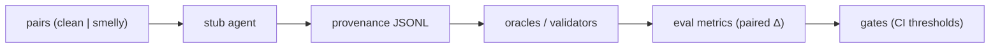

# Agent Smell Degradation Harness

Offline twin of [`rag-reliability-harness`](https://github.com/danteacosta/rag-reliability-harness) for measuring requirement-smell-induced semantic degradation in LLM agent episodes.

[](.github/workflows/eval.yml)

## Flow



## Failure modes

| Mode | What breaks | Reproduce |
|------|-------------|-----------|
| **smell-blind** (FM1) | Agent ignores smell signals; paired degradation rises | `python -m eval.simulate_regressions --mode smell-blind` |
| **oracle-mismatch** (FM2) | Validators disagree with semantic oracle | `python -m eval.simulate_regressions --mode oracle-mismatch` |
| **provenance-collapse** (FM3) | Semantic provenance skipped; observability blind spot | `python -m eval.simulate_regressions --mode provenance-collapse` |

Each mode is injectable for ATDD: pre-harness baseline catch rate 0.0 → post-harness 1.0.

## Quickstart

```bash
python -m venv .venv
source .venv/bin/activate
pip install -e ".[dev]"
make all
```

`make all` runs `test` → `eval` → `simulate` → `gate` in order (see [interop contracts](docs/interop.md)).

Optional: pass a single failure mode to simulate:

```bash
make simulate MODE=smell-blind
```

## Data note

Requirement pairs are seeded from **MesaFlow** as a local, curated starting set. MesaFlow is a development seed — not a peer-reviewed claim of external validity for thesis or production use.

## Roadmap (Tier 0→3)

| Tier | Focus | Exit gate |
|------|-------|-----------|
| **0** | Repo skeleton, episode schema, MesaFlow seed pairs, empty overlay stubs | Benchmark seed exists |
| **1** | Stub agents, FM1–FM3, offline `make all` + CI | **Public repo DoD** (current) |
| **2** | Taxonomy (**C1**), observability baselines (**C4**), live `make experiment` | Effect + observability gates |
| **3** | Mitigation (**C5**), full protocol stats (**C3**), dissertation packaging | Mitigation gate; dissertation DoD (**current**) |

Full tier definitions, thesis contribution mapping, and decision gates: [design spec](docs/superpowers/specs/2026-07-20-agent-smell-degradation-harness-design.md). Implementation plans: [plans README](docs/superpowers/plans/README.md).

## Tier 2 (offline overlays)

Tier 2 adds taxonomy labels, observability baselines, analysis reports, and an optional live experiment path — all without breaking Tier 1 CI.

| Command | Purpose |
|---------|---------|
| `make analysis` | Run happy + smell-blind evals; write `eval/analysis_report.json` with effect/observability flags |
| `make experiment` | Live experiment entrypoint (refuses without credentials; use `--stub-as-live` for offline schema demo) |
| `pip install -e ".[live]"` | Optional OpenAI adapter (`agents/live.py`); raises `NotConfiguredError` without API key |

Analysis and experiment exports are gitignored; `make gate` still reads only `eval/last_run.json` from `make eval`.

## Tier 3 (mitigation + dissertation packaging)

Tier 3 adds offline rewrite/clarify mitigation policies, an H5 trade-off report, and a dissertation export bundle — still secret-free and non-blocking for Tier 1 CI.

| Command | Purpose |
|---------|---------|
| `make mitigation` | Compare `direct` / `rewrite` / `clarify` under smell-blind; write `eval/mitigation_report.json` |
| `make dissertation` | Aggregate analysis + mitigation + paired stats; write `eval/dissertation_bundle.json` |
| `python -m eval.mitigation_report` | Same as `make mitigation` |
| `python -m eval.dissertation_bundle` | Same as `make dissertation` |

Mitigation policies (`rewrite`, `clarify`) run before stub generation on smelly variants; the trade-off report records benefit vs overhead but does **not** claim mitigation is always positive. Export guide: [docs/dissertation/README.md](docs/dissertation/README.md).

## Design & sister harness

- Full design spec: [docs/superpowers/specs/2026-07-20-agent-smell-degradation-harness-design.md](docs/superpowers/specs/2026-07-20-agent-smell-degradation-harness-design.md)
- Sister narrative and shared contracts (no shared code): [docs/interop.md](docs/interop.md) — parallel layout with `rag-reliability-harness` (`eval/`, `gates/`, `observability/`, threshold-driven gates, injectable failure modes, offline-first CI).
