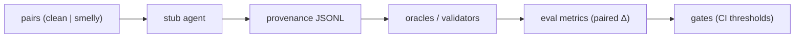

# Agent Smell Degradation Harness

Offline twin of [`rag-reliability-harness`](https://github.com/example/rag-reliability-harness) for measuring requirement-smell-induced semantic degradation in LLM agent episodes.

[](.github/workflows/eval.yml)

## Flow



## Failure modes

| Mode | What breaks | Reproduce |
|------|-------------|-----------|
| **smell-blind** (FM1) | Agent ignores smell signals; paired degradation rises | `python -m eval.simulate_regressions --mode smell-blind` |
| **oracle-mismatch** (FM2) | Validators disagree with semantic oracle | `python -m eval.simulate_regressions --mode oracle-mismatch` |
| **provenance-collapse** (FM3) | Semantic provenance skipped; observability blind spot | `python -m eval.simulate_regressions --mode provenance-collapse` |

Each mode is injectable for ATDD: pre-harness baseline catch rate 0.0 → post-harness 1.0.

## Quickstart

```bash
python -m venv .venv
source .venv/bin/activate
pip install -e ".[dev]"
make all
```

`make all` runs `test` → `eval` → `simulate` → `gate` in order (see [interop contracts](docs/interop.md)).

Optional: pass a single failure mode to simulate:

```bash
make simulate MODE=smell-blind
```

## Data note

Requirement pairs are seeded from **MesaFlow** as a local, curated starting set. MesaFlow is a development seed — not a peer-reviewed claim of external validity for thesis or production use.

## Design & sister harness

- Full design spec: [docs/superpowers/specs/2026-07-20-agent-smell-degradation-harness-design.md](docs/superpowers/specs/2026-07-20-agent-smell-degradation-harness-design.md)
- Sister narrative and shared contracts (no shared code): [docs/interop.md](docs/interop.md) — parallel layout with `rag-reliability-harness` (`eval/`, `gates/`, `observability/`, threshold-driven gates, injectable failure modes, offline-first CI).
