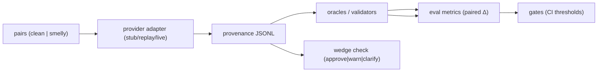

# Agent Smell Degradation Harness

**Product wedge:** a reliability layer / CI check for coding agents — given a spec and agent run, emit **approve / warn / block** before intent loss reaches production. The product surface is deliberately separate from the confirmatory thesis protocol.

**Research questions:** RQ1 measures degradation induced by defective requirements; RQ2 tests whether pre-final, oracle-free observability improves deployable warning. RQ3 evaluates clarification only when that optional extension is enabled.

Design for this wedge: [wedge-first reliability check spec](docs/superpowers/specs/2026-07-22-wedge-first-reliability-check-design.md)

Offline twin of [`rag-reliability-harness`](https://github.com/danteacosta/rag-reliability-harness) for measuring requirement-smell-induced semantic degradation in LLM agent episodes.

Evaluation task coverage is configured through domain adapters: acceptance-criteria generation is the primary task, traceability is a completed-episode validator, and code generation remains an optional adapter. The default configuration preserves the existing `codegen` and `test_gen` benchmark coverage.

[](.github/workflows/eval.yml)

## Wedge check (local / CI)

```bash
python -m wedge --fixture demo-clean     # approve
python -m wedge --fixture demo-smelly    # clarify (smell + direct policy)
python -m wedge --fixture demo-degraded  # warn (terminal-label regression)
make wedge-check
```

Consumer wiring guide: [docs/wedge.md](docs/wedge.md)

## Constraint replay gate (pre-merge)

The canonical pre-merge path is the offline replay gate. It consumes an ARP
2.0.5 pre-final trace (package 2.0.6) and adds constraint-level preservation
evidence; it does not replace tracing systems such as OpenTelemetry, Phoenix,
or Langfuse. The checked-in fixtures are synthetic and non-confirmatory.

```bash
python -m replay --fixture clean --json out/report.json --sarif out/report.sarif
# arbitrary public bundle:
python -m replay --bundle path/to/bundle --json out/report.json --sarif out/report.sarif
```

The command runs without provider credentials after one dependency install and
returns `0/10/20/30` for approve/warn/block/invalid-contract. JSON and SARIF
are deterministic, and the GitHub Action uploads both as artifacts so fork
pull requests remain reviewable. See the [ARP contract](https://github.com/danteacosta/agent-reliability-protocol),
the sister [RAG reliability harness](https://github.com/danteacosta/rag-reliability-harness),
and [the thesis/product boundary](docs/thesis-product-boundary.md).

The demo workflow keeps Code Scanning upload disabled because its synthetic
block is intentionally an alert. A real installation can set the repository
variable `REPLAY_UPLOAD_SARIF=true` after replacing the fixtures with its own
policy-approved bundle; fork pull requests continue using the artifact
fallback.

## Flow


```mermaid
flowchart LR
  pairs["pairs (clean | smelly)"]
  agent["provider adapter (stub/replay/live)"]
  prov["provenance JSONL"]
  oracle["oracles / validators"]
  eval["eval metrics (paired Δ)"]
  gate["gates (CI thresholds)"]
  wedge["wedge check (approve|warn|clarify)"]

  pairs --> agent --> prov --> oracle --> eval --> gate
  prov --> wedge
  oracle --> eval
```

## Failure modes

| Mode | What breaks | Reproduce |
|------|-------------|-----------|
| **smell-blind** (FM1) | Agent ignores smell signals; paired degradation rises | `python -m eval.simulate_regressions --mode smell-blind` |
| **oracle-mismatch** (FM2) | Validators disagree with semantic oracle | `python -m eval.simulate_regressions --mode oracle-mismatch` |
| **provenance-collapse** (FM3) | Semantic provenance skipped; observability blind spot | `python -m eval.simulate_regressions --mode provenance-collapse` |

Each mode is injectable for ATDD: pre-harness baseline catch rate 0.0 → post-harness 1.0.

## Quickstart

```bash
python -m venv .venv
source .venv/bin/activate
pip install -c constraints.txt -e ".[dev]"
make all
```

The Make targets use the active project interpreter. In automation, the
equivalent explicit form is `PYTHON=.venv/bin/python make all`; no globally
installed `pytest` executable is required.

After dependencies are acquired and cached (or supplied in `./wheelhouse`),
replay can execute offline with `pip install --no-index --find-links
./wheelhouse -c constraints.txt -e .`. The constraints pin the ARP release and
test/runtime packages; because ARP is a direct VCS dependency, a clean machine
still needs a one-time acquisition/build step before offline installation.

`make all` runs `test` → `eval` → `simulate` → `gate` in order (see [interop contracts](docs/interop.md)).

Optional: pass a single failure mode to simulate:

```bash
make simulate MODE=smell-blind
```

## Data note

Requirement pairs are seeded from **MesaFlow** as a local, curated starting set. MesaFlow is a development seed — not a peer-reviewed claim of external validity for thesis or production use.

## V4 scientific contract

Acceptance-criteria generation is the primary workload; traceability is an external completed-episode validation; code generation is optional. The feature plane consumes only pre-final evidence, while the independent label plane owns terminal evaluation. The principal scientific output is an observability boundary map across workload, defect family, checkpoint, model and deployment metrics—not a new requirement-smell taxonomy.

The reproducible pre-pilot uses 12 intents × clean/smelly variants × 5 replications and writes manifests, episodes, events, artifacts, labels, features and analysis. Run it with `make prepilot`.

The acceptance boundary, estimands, leakage rules, split invariants, and product policy are documented in [Thesis and Product Boundary](docs/thesis-product-boundary.md). A pre-pilot manifest must contain 12 independent source intents; renaming duplicated seed records does not satisfy the count.

The current orientation and related-work review is versioned in [2026-08-10 orientation review](docs/research/2026-08-10-orientation-review.md). It records the novelty boundary, EASY alignment, direct comparison with prefix monitors, and the evidence still required before a confirmatory claim.

The master's scope, academic contribution, non-claims, and chapter boundary are
frozen in [Master's Thesis Scope](docs/thesis/masters-scope.md). H1/H2 remain
planned conditional claims until the external data, provider, annotation,
preregistration, and shadow-pilot gates pass.

The current collection blocker and acceptance checklist are documented in [confirmatory data acquisition](docs/research/confirmatory-data-acquisition.md). The checked-in seven-source seed is development-only. Confirmatory provider execution rejects stub mode and supports OpenAI and Anthropic adapters; offline replay remains schema validation, not thesis evidence.

The scientific and commercial moat audit is recorded in [2026-08-10 moat stress test](docs/research/2026-08-10-moat-stress-test.md). Its conclusion is intentionally conservative: the stack is protocol-ready with a promising wedge, but the moat is not demonstrated until external data, independent labels, provider diversity, adoption, and ROI evidence exist.

The executable customer-validation sequence and metric schema are in the
[product pilot protocol](docs/product-pilot.md). It starts in shadow mode and
does not treat synthetic replay outcomes as customer evidence.

## Offline overlays

Offline overlays add deployable baselines, analysis reports, and an optional live experiment path without changing the core CI gate.

| Command | Purpose |
|---------|---------|
| `make analysis` | Run happy + smell-blind evals; write `eval/analysis_report.json` with effect/observability flags |
| `make experiment` | Live experiment entrypoint (refuses without credentials; use `--stub-as-live` for offline schema demo) |
| `pip install -e ".[live]"` | Optional OpenAI adapter (`agents/live.py`); raises `NotConfiguredError` without API key |

Analysis and experiment exports are gitignored; `make gate` still reads only `eval/last_run.json` from `make eval`.

## Optional clarification extension

Clarification and rewrite experiments are optional extensions. They do not block the pre-pilot, pilot, defense, or the core CI pipeline; when enabled, their effect is reported as conditional E3 rather than a mandatory thesis claim.

| Command | Purpose |
|---------|---------|
| `make extension-clarification` | Compare optional `direct` / `rewrite` / `clarify` policies; write `eval/mitigation_report.json` |
| `make extension-dissertation` | Build the optional extension report bundle |

The default runner, pre-pilot and CI use `direct`; clarification experiments opt in explicitly through the extension commands. Their trade-off report is conditional E3, not an unconditional mitigation claim. Export guide: [docs/dissertation/README.md](docs/dissertation/README.md).

## Pre-experiment tooling

Offline preflight before live LLM runs (secret-free; default CI unchanged):

| Command | Purpose |
|---------|---------|
| `make dry-run` | Write `runs/<run_id>/manifest.json` and `prompts/*.txt` with no API calls |
| `python -m eval.experiment --mock-live` | Exercise `LiveAgent` + `MockTransport` under `runs/` |
| `python -m eval.thesis_analysis --episodes PATH` | H1 paired-degradation tables and negative-boundary flags |
| `make thesis-analysis` | Analyze `eval/last_run_episodes.jsonl` after `make eval` |
| `python -m eval.h2_detection` | Group-split detector comparison for deployable pre-final signals |

Pair loading validates schema; oracle scoring is tolerant of extra artifact keys. IRR utilities live in `protocol/irr.py` with annotation templates under `data/annotation/`.

## Design & sister harness

- Full design spec: [docs/superpowers/specs/2026-07-20-agent-smell-degradation-harness-design.md](docs/superpowers/specs/2026-07-20-agent-smell-degradation-harness-design.md)
- Wedge-first strategy: [docs/superpowers/specs/2026-07-22-wedge-first-reliability-check-design.md](docs/superpowers/specs/2026-07-22-wedge-first-reliability-check-design.md)
- Sister narrative and shared contracts (no shared code): [docs/interop.md](docs/interop.md) — parallel layout with `rag-reliability-harness` (`eval/`, `gates/`, `observability/`, threshold-driven gates, injectable failure modes, offline-first CI).
