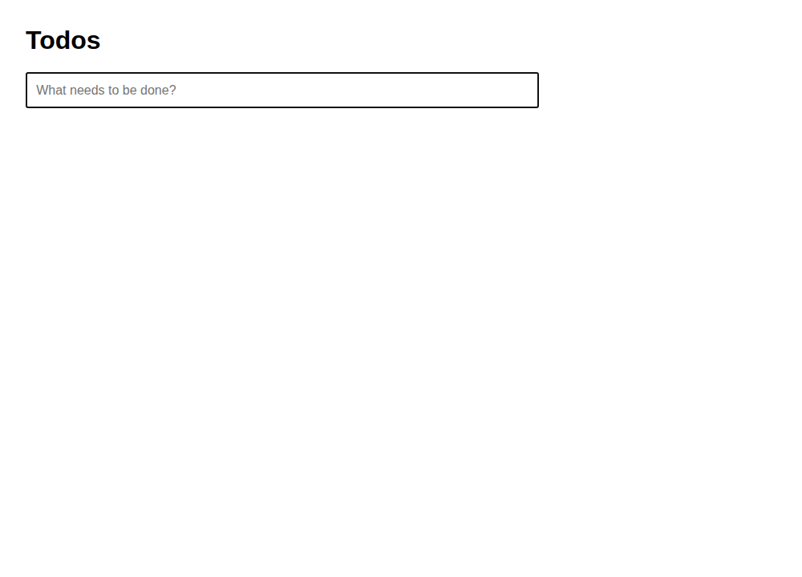
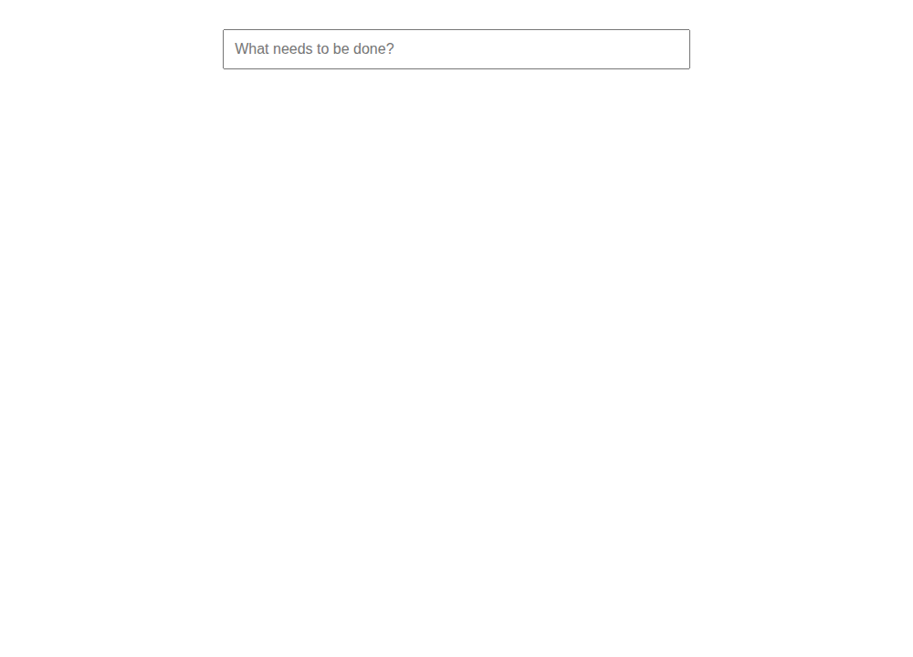

# Source obligation → criteria → browser behavior: exploratory results

The target is page-load focus of the new-todo input in the pinned TodoMVC New todo subsection. This is a generated standalone implementation of one subsection, not upstream TodoMVC or full-app compliance.

All 52 eligible Codex subscription calls completed with structurally valid HTML responses. The 54 planned slots retain two missing upstream-criterion slots; no repair, retry, resume, API-key fallback or additional purchase occurred. All code was collected before browser execution.

The direct route failed focus in all six omission outputs and none of its twelve complete/rewrite outputs. The criteria route failed focus in ten of twelve omission outputs; two omission outputs preserved focus. Its ten executable complete and twelve rewrite outputs passed. All sixteen failures affected only initial focus; the six other assertions passed for every executable artifact. This is local behavioral evidence under the declared instrument, not a population effect.

## Outcomes and planned denominators

Counts below are **target failures / planned slots (unknown slots)**. C−A measures an increase in focus failures, unlike the earlier criteria study whose endpoint was coverage. Bounds represent missingness, not confidence intervals. Each row is still the same source intent, not a new independent requirement.

| Route | Code generator | Criterion generator | A | B | C | C−A bounds, pp |
|---|---|---|---|---|---|---|
| criteria_only | luna | luna | 0/3 (1) | 0/3 (0) | 3/3 (0) | [66.67, 100.00] |
| criteria_only | luna | sol | 0/3 (0) | 0/3 (0) | 3/3 (0) | [100.00, 100.00] |
| criteria_only | sol | luna | 0/3 (1) | 0/3 (0) | 3/3 (0) | [66.67, 100.00] |
| criteria_only | sol | sol | 0/3 (0) | 0/3 (0) | 1/3 (0) | [33.33, 33.33] |
| direct | luna | — | 0/3 (0) | 0/3 (0) | 3/3 (0) | [100.00, 100.00] |
| direct | sol | — | 0/3 (0) | 0/3 (0) | 3/3 (0) | [100.00, 100.00] |

Executor categories: pass: 36, target_only_failure: 16, upstream_missing: 2.
Failed assertion counts: initial_focus: 16.

## Preselected screenshot pair

The direct-route Luna repetition1 A/C pair was chosen in the frozen protocol before dispatch, regardless of its outcomes. Screenshots are captured before input. The externally observed active element and original assertion report supply the focus evidence; visual appearance alone does not prove focus.

### A — pass
Slot `code-4a4ef2a298b0f80d0c3d`; active-element observation: `{"focused": true, "tag": "INPUT", "classes": "new-todo"}`.

Screenshot SHA-256: `e63e9d6327a05071975614f02947c5621b27324c246f45c22654f69717854279`.

### C — target_only_failure
Slot `code-79ad63df57d3aede3ba4`; active-element observation: `{"focused": false, "tag": "BODY", "classes": ""}`.

Screenshot SHA-256: `917f63b37717014965deb897de2f7d44941eaed085c44ef6c42c28d7c6e25f43`.

## Interpretation and limitations

The treatment removes the focus obligation from input text; program faults are not manually inserted into the generated outputs. Failure of the target test is a concrete source-relative behavioral violation under this instrument. Passing it establishes only the tested focus behavior; passing the assertion set does not prove whole-program correctness. Any recovery or no-effect cases are retained in the tables.

The frozen placement check requires a measurable empty list. Neither the source nor shared interface requires displaying an empty list, so a placement failure is an instrument-proxy outcome, not automatically a natural requirement defect. This limitation was identified after freezing, before inspecting generated outputs; original scores and categories remain unchanged. Non-target/mixed categories must be unpacked by assertion ID. The primary isolated-world focus observation is separate.

The case was selected retrospectively for feasibility from the already exposed PR 66 corpus. There is one source intent, two requested model configurations and repeated sessions; no population estimate, p-value, independent project holdout, natural-smell generality or H1/H2 confirmation is claimed. Criteria-only prompts exclude original requirements, uncertainties, labels and sibling artifacts. Familiar TodoMVC selectors may cue recovery. Route differences also change information and representation and are not causal mediation estimates. No LLM judge supplies this behavioral endpoint, and no human validation is claimed.

Focus is observed after the declared 500 ms load horizon; actions also use 500 ms settling. Timing is an instrument convention, not a source-defined SLA. Chromium sandbox is disabled inside offline non-root resource-bounded Docker; qualification is not a proof against arbitrary browser exploits.

## Provenance and verification

Independent recomputation verified 754 receipt-listed files and all 18 analysis groups. Final receipt: `cf7f03ce23dd98331cec8f6042668d690f7475fa16487d437eb550c97b4cbef1`. Frozen receipt: `3675285c07b128fdad91b81bfc18dd935d5a272b01481b8ce3fcb2fad81a099c`. Collector commit `cf8b270`; exact runtime image `sha256:52d524fb7dd8070139429eefa9f498159d21dd47cf5b886930ef8f6f2eb9c234`.
Usage events: 52; fields as reported (do not add cached/reasoning subsets again): `{"input_tokens": 717385, "cached_input_tokens": 166400, "cache_write_input_tokens": 0, "output_tokens": 19771, "reasoning_output_tokens": 3799}`. Response-model snapshots and API-equivalent USD cost are not exposed.

Nine authored browser controls qualified the instrument before collection, including alternative correct focus implementations, selective mutants, page spoofing, label formatting/visibility/trim and missing-label interface handling. Source and license snapshots, all original outputs, external reports and screenshots are preserved in the private packet `focus-chain-20260922-v1`. The predecessor `criteria-expansion-20260921-v1` is unchanged.

Portable verification: 1,694 tests and nine subtests passed; 21 skipped and four Linux resource-limit checks deferred to CI. Wheel and source-distribution builds passed. CI and integration status are tracked in [PR 67](https://github.com/danteacosta/agent-smell-degradation-harness/pull/67).

See the [frozen protocol](../plans/2026-09-22-criteria-code-chain.md), [cross-repository corrections](research-stack-audit-20260922.md), and [preceding criteria results](criteria-expansion-results-20260921.md).
