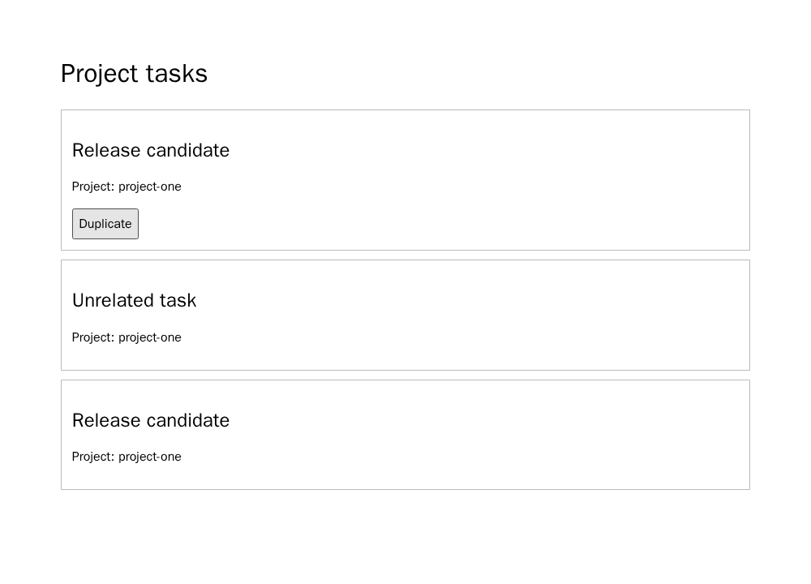
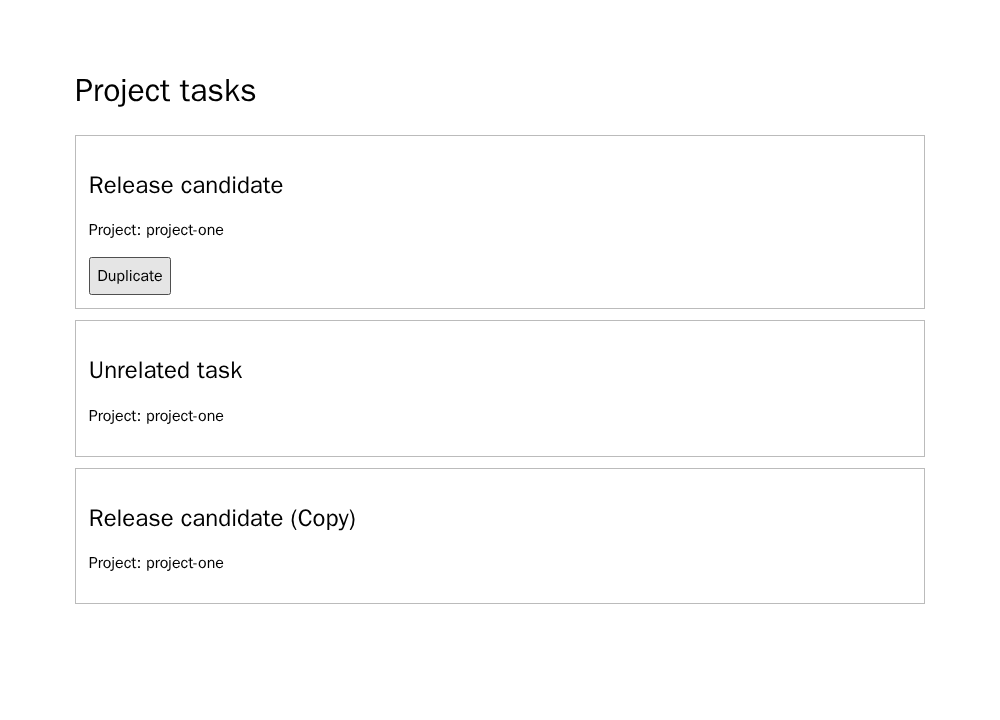
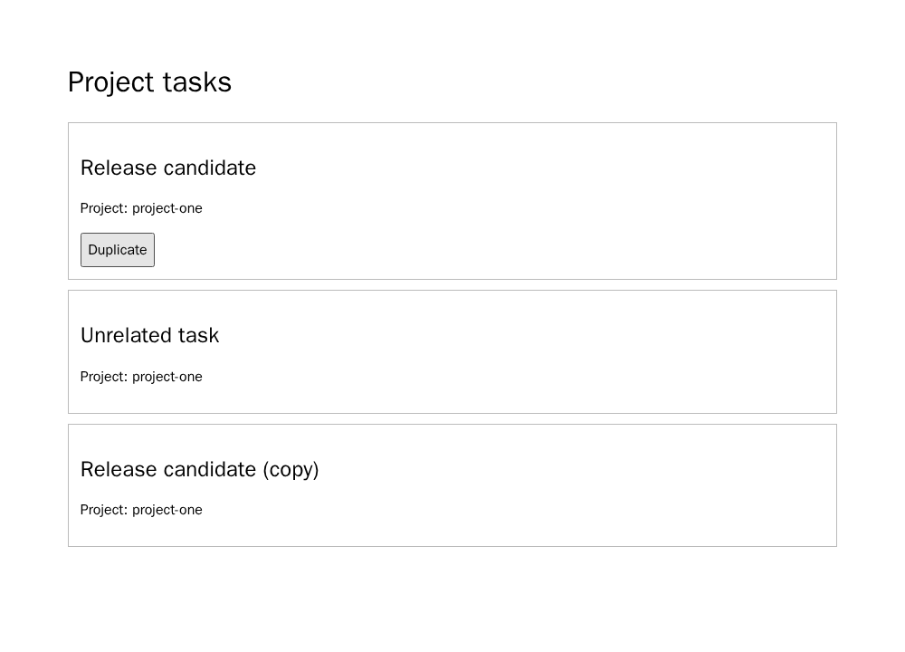

# Kanboard duplicate-title pilot: pre-generation qualification

This is the second selected Kanboard obligation. The source is the pinned
Kanboard documentation revision `4455fd04fb48ed42817fc99402d4c1fb3bde1c0d`:
duplicating a task within the same project creates a new task with the original
properties, and `title` is listed among those properties. The checked-in source
and MIT license bytes are hash-bound by the freeze. A/B/C are controlled
reconstructions rather than verbatim source excerpts. The choice of this case
followed earlier pilot outcomes, so this is exploratory.

The final browser page keeps its visible task list and initial state fixed.
The generated code can register only the Duplicate behavior. Two independent
fixtures use different task titles and project IDs. After the visible Duplicate
action, the browser requires one distinct new task, checks its visible project
label and that the source and unrelated tasks remain unchanged, and scores
only whether the new visible title equals the source title. If no distinct
duplicate exists, the result is an interface error, not a title failure.

Eight authored controls passed in the immutable, network-disabled Chromium
image `sha256:00d1265095773b7f8a12aa73e81d0bab75563cbd672dd0b5d91783ea1b6d4400`:

| Control | Expected and observed category |
| --- | --- |
| Reference | pass |
| Alternative correct implementation | pass |
| Title-only mutant | target-only failure |
| Wrong-project mutant | non-target-only failure |
| Duplicate identity | interface error |
| Duplicate pre-created before the click | interface error |
| Missing behavior | interface error |
| Script error | browser error |

The first qualification attempt exposed two oracle problems before any model
generation: a blank duplicate title was treated as an unassessable element,
and a script error was masked by the missing-duplicate interface check. Both
were corrected. An independent review found that a duplicate pre-created in
hidden state could pass without a Duplicate handler; the runner now verifies
the pre-click state and registered handler. The final qualification was rerun
after this fix and after the project control was changed to read the visible
label. Earlier failed attempts remain private
diagnostics; only the final qualified bytes are frozen. Original final reports
and screenshots are in
`data/e2e-kanboard-duplicate-title/oracle-qualification-20260926/`.
The qualification also binds the classifier code hash, so scoring cannot
silently change after these controls pass.
The private full qualification receipt SHA-256 is
`499c6221f1c758b6cb6d89aa9e80cc15a74b38d96ff2a3817f93932e0d00581d`;
the 17-file public receipt is
`5907d3c461767321cab108ce6d60d919abe624dc920a3b4bf6962d3ba80e4337`.

Before generation, separate `gpt-6-sol`, `gpt-6-luna`, and `gpt-6-astra`
subscription calls all returned ACCEPT for the exact A/B/C texts and fixed
page: A/B preserve the same target, C deletes only title preservation, the
source supports the target, and the scaffold does not force the answer.
These are LLM instrument reviews, not human approval. The review prompt SHA-256
is `2eb67779af7249cd7af49f1c44c7e465810a732fc03d24a57844671b9199d872`;
the raw reviewer responses and hashes are in
`data/e2e-kanboard-duplicate-title/prompt-review-20260926/`.

The freeze in `data/e2e-kanboard-duplicate-title/freeze-20260926/` contains
18 randomized, balanced A/B/C × two-model × three-repetition requests. Its
manifest SHA-256 is
`9954878ecab7fa169fd421b319b0dbb47e6ee64428ed069dbb50789c08d19d32`.
All generations preceded browser execution, with no retry, repair or
replacement. Unknowns remain in the denominator. This qualification packet
predates generation; the original and diagnostic outcomes are recorded below.

## Original frozen result

All 18 saved-ChatGPT-Codex generations completed and passed exact-scaffold
admission. The collector then executed each page once in the qualified browser.
The private packet receipt SHA-256 is
`0f243dc3ce832638497c970636d40a327d36c98b90d14a9236b0ed7bf8f14cfe`.
It records 265,983 input tokens (101,888 cached), 10,400 output tokens and
2,715 reasoning output tokens. The CLI exposed neither an immutable model
snapshot nor a USD cost.

| Model | A complete | B reworded | C title omitted |
| --- | --- | --- | --- |
| `gpt-5.6-luna` | 2 pass, 1 unknown | 3 unknown | 1 pass, 2 target-only failures |
| `gpt-5.6-sol` | 1 pass, 2 unknown | 1 pass, 2 unknown | 2 pass, 1 unknown |

The nine unknowns were browser errors: the generated handlers called
`crypto.randomUUID()`, which was unavailable at the frozen
`http://fixture.invalid/` origin. Each failed before creating a duplicate;
none is a title defect. The original C−A target-failure difference is +2/6
on the planned denominator, or +2/5 versus 0/3 among evaluable outputs.
That observed contrast is vulnerable to the asymmetric unknowns, especially
five of six B outputs. It is not a clean estimate of a requirement effect.
The original reports, screenshots, analysis and hash receipt are in
`data/e2e-kanboard-duplicate-title/results-20260926/`; the public receipt
SHA-256 is
`6ead785fe0743ce4391db51578e08a631d1e4fdee0bc27ec9cfae417e076b5d7`.

## Post-outcome secure-origin diagnostic

After seeing the unknowns, the same 18 saved HTML artifacts were run once
under a diagnostic runner whose only change was the URL
`http://fixture.invalid/` to `http://localhost/`. No model was called again.
The diagnostic qualifier retained the eight original controls and added a
ninth correct implementation using `crypto.randomUUID()`; all nine passed
before those saved artifacts were re-evaluated. This is a post-outcome
sensitivity check, not a replacement for the frozen primary result.

| Model | A complete | B reworded | C title omitted |
| --- | ---: | ---: | ---: |
| `gpt-5.6-luna` | 3/3 pass | 3/3 pass | 1/3 pass, 2/3 target-only failure |
| `gpt-5.6-sol` | 3/3 pass | 3/3 pass | 3/3 pass |

All nine originally unknown outputs passed under `localhost`. The two C
failures remained failures: the duplicate visibly appended `(Copy)` or
`(copy)` to the source title while its identity, project and control rows
passed. The diagnostic C−A contrast is +2/6 overall, entirely in Luna; B−A
is zero. The [original A screenshot](../../data/e2e-kanboard-duplicate-title/results-20260926/browser/duplicate-title-d63825048279c69c38d8d4a1/fixture-1.png)
and [original C failure screenshot](../../data/e2e-kanboard-duplicate-title/results-20260926/browser/duplicate-title-bb8604bbe516537640270ba4/fixture-1.png)
show the browser-visible difference. The separate diagnostic runner,
qualification, reports, screenshots and receipt are in
`data/e2e-kanboard-duplicate-title/secure-origin-diagnostic-20260926/`.
Its public receipt SHA-256 is
`80b4ff36bf6ed6a650a9d32bb73e55e4a69b922ca969ba21cd185dff87243bdb`.

This adds a second obligation within Kanboard, not a new project. The case
was selected after earlier results, uses a narrow fixed page rather than the
upstream application, and has only three repetitions per model and arm.
The original fixture compatibility gap further limits interpretation.
Neither result estimates the formal H1 ordinal-severity outcome or tests H2.

## Nova replicação prospectiva com origem segura

Em 26 de setembro, uma coleta sucessora congelou **antes das novas gerações**
uma agenda aleatória de 18 posições A/B/C × dois modelos × três repetições.
Manteve os textos A/B/C e a página anterior, mas adotou o runner qualificado
em `http://localhost/`. A qualificação de nove controles, incluindo uma
implementação correta que usa `crypto.randomUUID()`, precedeu todas as chamadas.
O recibo do congelamento é
`cb0e899a1b53998b6edbd73d2527712f48a5dffd407c6b7679201eb4656c2c`.
Não se reutilizou nenhum HTML anterior, nem se reparou ou repetiu uma resposta.

**18/18 gerações novas** foram admitidas e **18/18 execuções no navegador**
ficaram avaliáveis. A e B passaram nas seis posições de cada braço. Em C,
Luna teve dois defeitos seletivos e um acerto; Sol teve três acertos. Nas duas
falhas, a cópia foi criada no mesmo projeto, as tarefas de origem e controle
permaneceram preservadas e não houve erro de console. Só o título da cópia
divergiu: `(Copy)` e `(copy)` foram acrescentados aos títulos originais.

| Modelo | A completa | B reescrita | C sem título |
| --- | ---: | ---: | ---: |
| `gpt-5.6-luna` | 3/3 acertos | 3/3 acertos | 1/3 acerto, 2/3 defeitos seletivos |
| `gpt-5.6-sol` | 3/3 acertos | 3/3 acertos | 3/3 acertos |

O contraste C−A de falha seletiva é **+2/6**, ou **+33,3 pontos percentuais**
no conjunto; ele se concentra em Luna (+2/3) e é zero em Sol. A conclusão
operacional é mais forte que a do primeiro lote: a origem não criou casos
desconhecidos, e uma nova geração reproduziu os dois defeitos seletivos no
mesmo modelo. Continua sendo **uma obrigação de um projeto**, escolhida após
resultados prévios, com apenas três repetições por célula. Não é estimativa
populacional, confirmação da H1 ordinal nem avaliação de H2.

O pacote privado selado tem recibo SHA-256
`cc0648c8c11b65dfbb3e4a6604588ff2d8f5becc785476bd71f3b2b7f3aa4ab9`.
O [resumo público](../../data/e2e-kanboard-duplicate-title/secure-replication-20260926/summary.json),
os 18 relatórios de navegador e as imagens têm recibo SHA-256
`5216d311eec6b1394023eebfdd1b8fec8406fc3cfbe06320ca61d39a698f3bf1`.
Os prints abaixo mostram um A ilustrativo e as duas falhas C; repetições
numéricas não são pares naturais entre braços.

