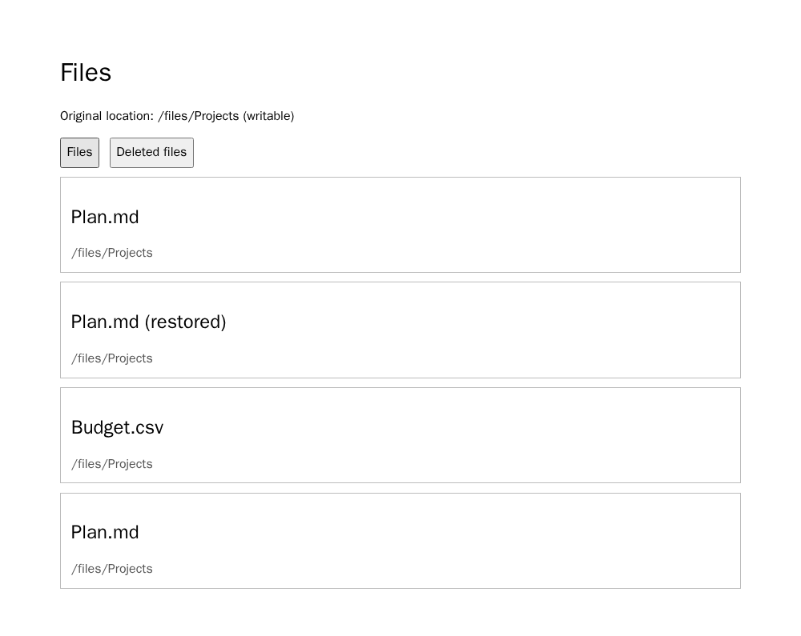

# Nextcloud: nome único na restauração

**Resultado exploratório prospectivo do sucessor:** 18 novas gerações,
18/18 saídas avaliáveis. A e B passaram 6/6 cada; C falhou apenas na
unicidade do nome em 6/6, três por modelo. A restauração, o diretório
original e os arquivos não relacionados permaneceram corretos nas saídas C.
É um contraste forte neste requisito selecionado, não uma estimativa de H1
para a população de requisitos.

A [fonte Nextcloud](../../data/e2e-six-projects/sources/nextcloud/deleted_file_management.rst)
diz que um item restaurado volta normalmente ao local original e recebe nome
único se já houver ali outro item com o mesmo nome. A/B incluem ambas as
obrigações; C retém o destino e omite apenas a regra de nome único. O endpoint
mostra o diretório original como caminho estruturado e gravável, dois arquivos
ativos capazes de colidir com nomes de restauração, um controle ativo, o
arquivo excluído e seu caminho original. O navegador clica **Restore**,
recarrega a vista Files e compara o nome restaurado com **todos** os nomes
ativos no diretório. Também verifica destino, identidades, preservação de
arquivos e remoção da lixeira. Duas fixtures usam nomes e caminhos distintos.
É uma réplica limitada da jornada, não a aplicação Nextcloud original.

Os três instrumentos anteriores foram [deferidos](nextcloud-restore-conflict-admission-20260926.md)
por não representar claramente o destino ou por comparar apenas com um nome.
O novo instrumento passou **10/10 controles** no Chromium fixado
`sha256:00d1265095773b7f8a12aa73e81d0bab75563cbd672dd0b5d91783ea1b6d4400`.
Incluiu colisão com o nome original, colisão com uma segunda alternativa de
nome, destino errado, arquivo não restaurado, arquivo não relacionado
corrompido, item retido na lixeira e erros de interface/script. Três revisores
LLM independentes deram ACCEPT antes das gerações, recibos
`aea994a1889382a7da83ae9e7bc2686e1f6082f18ab6037245534ef6c85e923b`
e `47d01b380019d13530ee3e91f1513b3e2e323dbb8bbd402c11632fef4fb56734`.
A revisão LLM não substitui adjudicação humana.

O **primeiro lote** de 18 gerações ficou congelado como falha de instrumento:
o coletor genérico exigiu prints `fixture-1.png` e `fixture-2.png`, enquanto
este oráculo produziu `files-1.png` e `files-2.png`. Classificou erroneamente
todos os relatórios completos como `browser_error`. O
[pacote público separado](../../data/e2e-nextcloud-restore-conflict/instrument-failure-20260927/summary.json)
e o recibo privado `114ab21421ab9b6815914cd816d58a1e9154126841f5e88ea8716d3ac333dacd`
preservam o resultado primário original.
Uma leitura diagnóstica posterior dos mesmos relatórios e PNGs identificou
A/B 12/12 passes e C 6/6 falhas-alvo; ela **não substitui** o lote original.

Antes de nova geração, um teste de contrato confirmou o nome correto dos
prints no coletor. O sucessor congelou fonte, licença, braços, prompts,
cronograma aleatório, runtime, oráculo, imagem e coletor no recibo
`50d94643fc2d70b1987c1122b18ec90a1641dc1b7d469ffed385b5d3a8db982c`.
Gerou todos os 18 HTMLs antes do navegador, usando a sessão ChatGPT do Codex,
sem chave de API, retry ou reparo.

| Modelo | A completa | B reescrita | C sem unicidade |
| --- | ---: | ---: | ---: |
| `gpt-5.6-luna` | 3 passes | 3 passes | 3 falhas-alvo |
| `gpt-5.6-sol` | 3 passes | 3 passes | 3 falhas-alvo |

O [pacote público do sucessor](../../data/e2e-nextcloud-restore-conflict/results-20260927/summary.json)
contém os 18 relatórios e oito prints, recibo
`2f4ecc5301033d89f02f29f8e6aaaedf0eceda3d6008caf9d0b6e89f143a6257`.
O pacote privado integral tem recibo
`4d491bca128de6c47dd5d2b0d8bec8f2156debcc274884468e8955cd2907f950`.

Esta é a **oitava obrigação nova executada** do bloco planejado, ainda entre
os mesmos seis projetos; faltam três. O tratamento corresponde à família
operacional de conteúdo parcial/incompletude semântica: a cláusula de
resolução de conflito foi removida. Isso não demonstra prevalência de smells
naturais. H1 ordinal e H2 continuam sem resposta decisiva.
