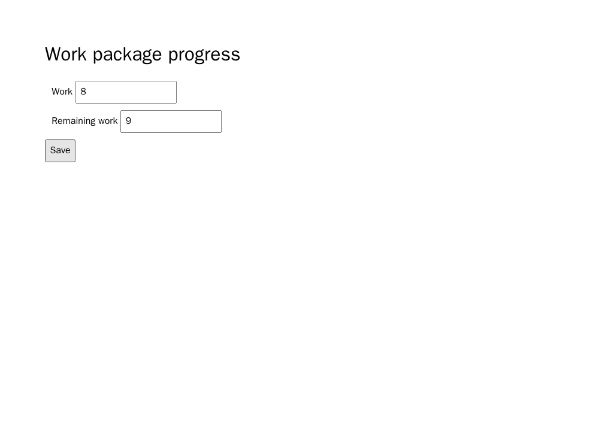

# OpenProject: salvar Remaining work inválido

**Resultado exploratório prospectivo:** 18/18 gerações novas foram avaliáveis.
A e B passaram 6/6 cada; C apresentou 6/6 falhas exclusivamente na regra
omitida, três por modelo. O caso acrescenta uma obrigação no OpenProject,
sem ampliar o número de projetos.

A [fonte OpenProject](../../data/e2e-six-projects/sources/openproject/progress-tracking.md)
diz que um valor de Remaining work maior que Work não pode ser salvo. A e B
incluem essa proibição; C mantém salvar Work e Remaining work, mas retira a
proibição. Trata-se de **omissão semântica de uma restrição de validação**,
alinhada à família ampla de incompletude da
[revisão de Alemneh e Berhanu](https://doi.org/10.2478/cait-2024-0037).
O subtipo é nossa interpretação operacional, não um rótulo validado de smell
natural. O [mapa dos experimentos](../thesis/e2e-smell-mapping-20260926.md)
explica a diferença para as categorias estreitas de Paska.

O navegador primeiro salva um valor válido e recarrega. Depois tenta salvar
Remaining work maior que Work e recarrega novamente. A obrigação é satisfeita
se o valor válido anterior persistir. Duas fixtures usam Work 8/12 e valores
inválidos 9/13; os controles não alvo exigem que a edição válida salve e que
Work permaneça inalterado. O endpoint verifica rejeição persistida; não
verifica o texto da mensagem de erro. É uma página de experimento derivada da
obrigação, não a aplicação OpenProject original.

Antes da geração, o instrumento passou **8/8 controles** no navegador
Chromium fixado `sha256:00d1265095773b7f8a12aa73e81d0bab75563cbd672dd0b5d91783ea1b6d4400`.
Três revisores LLM isolados deram ACCEPT ao mapeamento fonte→endpoint, à
equivalência A/B e à omissão única em C. Recibos da qualificação e do painel:
`9b47da31aaa44256cdc04ae38f37d4bc5f4f83349feb0973c9afbd90a13dd07d`
e `095cf9c0cd3a251592da4037ab01eefc59687b4df9f564af7ef3d20ca2dd25b2`.
Essa revisão não substitui uma adjudicação humana.

O cronograma aleatório A/B/C × Luna/Sol × três repetições, prompts, fonte,
licença, runtime e oráculo foram congelados antes das gerações. Recibo
`e257db4c0a68e549323b6af4277d30627485f56e3a670fff4b61c490c0f5d02e`.
As chamadas usaram a sessão ChatGPT do Codex, sem chave de API, retry ou
reparo. Todos os 18 HTMLs foram gerados antes de começar a execução no
navegador.

| Modelo | A completa | B reescrita | C sem proibição |
| --- | ---: | ---: | ---: |
| `gpt-5.6-luna` | 3/3 passes | 3/3 passes | 3/3 defeitos-alvo |
| `gpt-5.6-sol` | 3/3 passes | 3/3 passes | 3/3 defeitos-alvo |

O contraste descritivo C−A de falha-alvo é **+6/6**. Como as três repetições
de cada modelo compartilham requisito, prompt e scaffold, não equivalem a
seis requisitos independentes. O [pacote público](../../data/e2e-openproject-invalid-remaining/results-20260926/summary.json)
contém 18 relatórios de navegador e oito prints de prova, com recibo
`4df91adb0d2ca6320daaf13bef7fa77172bcbd533eb3272487918c2173f952ee`.
O pacote privado integral tem recibo
`eb9e7cd7ee75eca8e6c12eb35fe5164eb398f3c6d46af5f9b79f05aa7f991dd7`.

É a **quinta obrigação nova executada** do conjunto planejado. Restam seis
obrigações novas; a ponte TodoMVC já foi executada separadamente. Este piloto
não estima o efeito médio da família de smells, não mede a severidade ordinal
de H1 e não testa o alerta antecipado de H2.
