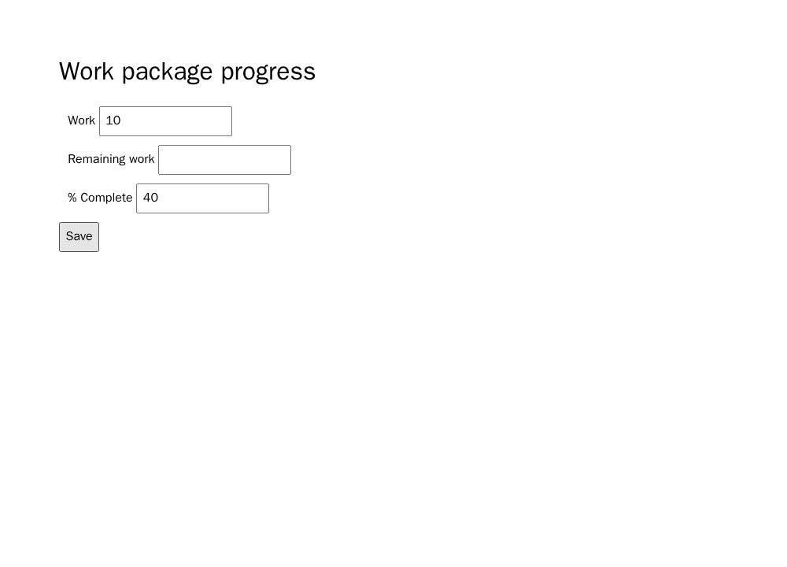

# OpenProject Remaining work: prospective browser pilot

This packet adds one previously unexecuted obligation in a project already
represented in the exploratory six-project series. It does not add a seventh
project or confirm H1/H2. The case came from the OpenProject progress-tracking
guide at upstream revision `de051918ba8771d5415c172cc81bcd49f7d10472`:
with Work already set, entering % Complete derives Remaining work. The local
source and GPL license are hash-bound in the freeze manifest. The A/B/C texts
are controlled reconstructions, not verbatim upstream excerpts.

The browser endpoint is fixed before generation. After saving and reloading,
Work 10 hours with 40% Complete must show Remaining work 6 hours; Work 20
hours with 25% Complete must show 15 hours. Work and % Complete must also
survive the save and reload. A target failure is reported separately from
those controls. Invalid interface, browser errors, missing screenshots, or
malformed reports are not scored as target-only defects.

The pinned image is
`sha256:00d1265095773b7f8a12aa73e81d0bab75563cbd672dd0b5d91783ea1b6d4400`.
Seven authored controls passed in real offline Chromium: two correct
implementations, a target mutant, a non-target mutant, a duplicate visible
control, absent behavior, and a script error. The complete reports, screenshots,
and hash receipt are in
`data/e2e-openproject-remaining/oracle-qualification-20260926/`.
These screenshots validate the oracle; they are not generated-model results.

Before generation, separate `gpt-5.6-luna` and `gpt-5.6-sol` reviewer calls
both returned ACCEPT for the exact A/B/C requirements and scaffold. They judged
A/B equivalent for the target, C limited to deleting the derivation, and found
no formula leakage in the C prompt or scaffold. Their responses are stored in
`data/e2e-openproject-remaining/prompt-review-20260926/`. This is LLM review,
not independent human approval, and it does not establish oracle validity by
itself.

The freeze at `data/e2e-openproject-remaining/freeze-20260926/` contains 18
randomized, balanced slots: three arms, two model configurations, three
repetitions. One call per slot, no retry or repair. All outputs are collected
before any generated page is executed in the browser. The private receipt must
retain invalid outputs, provider failures, and unevaluable slots. C−A is the
browser target-failure contrast, and B−A checks wording sensitivity. This is
exploratory evidence within one project and uses a browser failure endpoint,
not the formal human ordinal-severity H1 endpoint. H2 is not evaluated.

## Collected result

All 18 saved-ChatGPT-Codex generations completed before the first generated
page was executed. There were no provider errors, output-admission failures,
browser errors, or unevaluable slots. The provider reported 265,844 input
tokens (62,464 cached), 9,170 output tokens, and 2,103 reasoning output tokens;
it did not expose an immutable model snapshot or USD cost. The private packet
receipt SHA-256 is
`083dbed9641aafe5b32cbfd1eb570f73c2a924d9e57ad656d039d4c8bca99d24`.

| Model | A: complete | B: reworded | C: derivation omitted |
|---|---:|---:|---:|
| `gpt-5.6-luna` | 3/3 pass | 3/3 pass | 3/3 target-only failure |
| `gpt-5.6-sol` | 3/3 pass | 3/3 pass | 3/3 target-only failure |

Every browser report retained Work and % Complete after save and reload in
both numeric fixtures, with no console errors. Every A/B artifact derived 6h
from Work=10h and 40%, and 15h from Work=20h and 25%. Every C artifact left
Remaining work blank in both fixtures. The observed C−A target-failure
difference is +100 percentage points in each model cell; B−A is zero. These
are descriptive contrasts over three repeated calls per cell, not six
independent requirements or a general-effect estimate.

The original browser reports and all 36 screenshots are in
`data/e2e-openproject-remaining/results-20260926/`. Its public receipt SHA-256
is `a5a392cd045d8f185164e3337b3bb2d5ef4f79cc9c64dc9c9c3d36b2f3ab40b2`.
The following original captures show one A/C pair for each model, after the
first save and reload; the second fixture is also included in the public bundle.

| Model | A: derivation present | C: derivation omitted |
|---|---|---|
| Luna |  |  |
| Sol |  |  |

This adds a clean within-requirement browser demonstration in OpenProject.
The selected obligation and scaffold follow earlier pilots, so selection and
scaffold effects remain plausible. One case cannot establish a general effect
of requirement smells, the formal H1 severity endpoint, or the H2 claim that
pre-final provenance signals predict defects. The next scientific decision is
to obtain independent human review of the mappings and labels and run a small
predeclared set of other obligations/projects, reporting null results and
unknowns without replacement.
