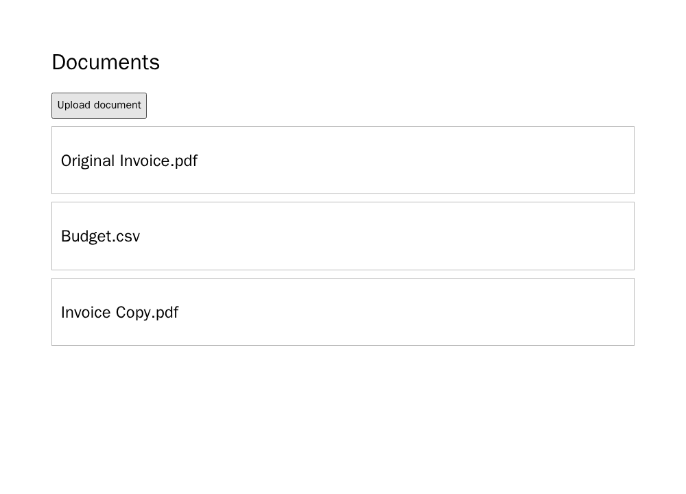
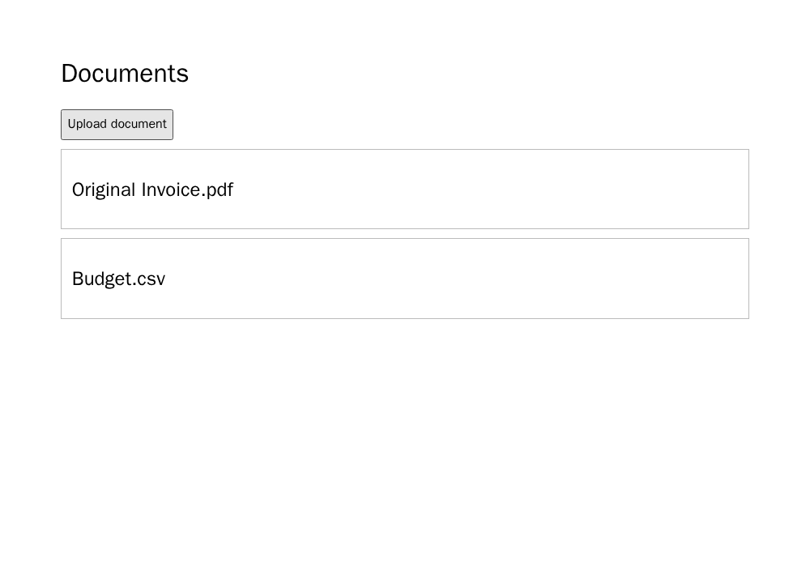

# Paperless-ngx: consumo de duplicata em E2E

**Resultado do sucessor congelado:** 18 gerações novas, 18 páginas avaliáveis,
12/12 acertos em A/B e **4/6 falhas seletivas em C**. As outras duas saídas C
preservaram a aceitação da cópia. É evidência exploratória de uma obrigação
nova no Paperless-ngx; não confirma H1 ordinal nem H2.

## Fonte e endpoint

A [fonte fixada](../../data/e2e-six-projects/sources/paperless-ngx/usage.md)
declara que, por padrão, um arquivo com o mesmo checksum de um documento
existente não é rejeitado: a nova cópia é consumida. O teste pontua apenas
essa aceitação, não o aviso de duplicata ou o link para o documento original,
que são outras obrigações do mesmo trecho. A tela é um **replica limitado**:
carrega um documento original e um controle, clica em Upload para um arquivo
com o mesmo checksum do original, recarrega e observa se existe uma cópia
distinta, preservando os dois registros anteriores. Duas fixtures usam nomes
e checksums diferentes. Isso não testa a aplicação Paperless-ngx original.

Antes de qualquer geração, o oráculo passou nove controles no Chromium fixado
`sha256:00d1265095773b7f8a12aa73e81d0bab75563cbd672dd0b5d91783ea1b6d4400`:
três implementações corretas (inclusive `app.addDocument(file)`), mutante que
rejeita a cópia, mutante que altera o original, inserção só visual que desaparece
na recarga, cópia pré-criada, handler ausente e erro de script. O recibo privado
da qualificação final é
`037efd07e5ec0f91eebfa4dccb3b2bd62a026ece4bf8c6a070818138a9f5eb74`.

A/B exigem aceitar uma nova cópia com checksum igual; C preserva a ação de
upload e os controles, mas omite a aceitação. Três revisores LLM isolados
aceitaram o instrumento final **antes da segunda coleta**, depois de receber
o resultado dos controles que demonstra que a API permite tanto adicionar
quanto rejeitar. O recibo dessa revisão é
`69cdb8c6e3492916ab58d01b42520bfb43cd1675ecc85f23267312652521c4ea`.
Isso é revisão de instrumento, não avaliação dos resultados
gerados nem aprovação humana. O primeiro parecer e as revisões divergentes
ficam preservados em pacotes privados distintos.

## Primeiro lote: falha de instrumento preservada

O primeiro scaffold entregava um arquivo `{name, checksum}` ao código gerado,
mas `app.addDocument` exigia `{id, title}`. A primeira coleta completou 18
gerações e nenhum caso passou: **9 erros de navegador e 9 falhas-alvo**, inclusive
em A. Vários A/B chamaram `app.addDocument(upload)` e receberam erro de ID;
outros criaram ID, mas deixaram o título vazio. Um controle novo reproduziu a
falha antes da correção. Esse lote é uma **falha de interface experimental**;
não pode ser usado como contraste causal ou reclassificado depois. Seu recibo
privado é `284a0577bf68de5fdbcb42761c49c2b9d7563596fd82a41ac2b381a4b7eca9e6`;
os [18 relatórios originais](../../data/e2e-paperless-duplicate-consumption/instrument-failure-20260926/summary.json)
têm recibo público
`d63147af45ed094ad5821f9dc7541bc597ed13de8130365f9f1a3bc49c69618f`.

## Sucessor prospectivo

O scaffold corrigido aceita o arquivo recebido diretamente e atribui ID e
título visível sem decidir se a duplicata deve ser consumida. O handler gerado
continua decidindo se chama `app.addDocument`. Nova qualificação e revisão
precederam o congelamento de **outros 18 prompts**, em ordem aleatória,
três braços × dois modelos × três repetições. O recibo do congelamento é
`78142e099ba3ff73826dcde98d5bd0eb86165c1273d093364e83147aad169d79`.
As 18 chamadas pela assinatura ChatGPT terminaram antes de abrir qualquer
HTML no navegador, sem chave de API, retry, reparo ou reaproveitamento do lote
anterior. As 18 páginas foram admitidas e avaliáveis.

| Modelo | A completa | B reescrita | C sem aceitação |
| --- | ---: | ---: | ---: |
| `gpt-5.6-luna` | 3/3 acertos | 3/3 acertos | 3/3 falhas seletivas |
| `gpt-5.6-sol` | 3/3 acertos | 3/3 acertos | 2/3 acertos, 1/3 falha seletiva |

O contraste descritivo de falha-alvo C−A é **+4/6**, ou **+66,7 pontos
percentuais** no conjunto: +100 p.p. em Luna e +33,3 p.p. em Sol. Nas quatro
falhas, a condição C gerou um handler que compara checksum e deixa de adicionar
a cópia correspondente; original e controle permanecem visíveis, sem erro de
console. Nas duas saídas C de Sol que passaram, o modelo adicionou a cópia
mesmo sem essa obrigação explícita. Repetições não são novos requisitos, e
este recorte foi escolhido após pilotos anteriores.

O [resumo público com os 18 relatórios](../../data/e2e-paperless-duplicate-consumption/results-20260926/summary.json)
e os prints têm recibo
`7730bcd29019a29f65f3b3db7614959c6830b47dd3fd3cb449c9e18df816ec18`.
O pacote privado selado tem recibo
`9310d15cb251649acf658709eecea76e414b0f818e0016595dba0b5bd2ea1a14`.
As imagens A e C abaixo usam a mesma fixture, mas as repetições entre braços
não formam pares naturais.

O resultado reforça que a omissão **pode** causar defeito visível em outro
contexto, ao mesmo tempo em que mostra recuperação por modelo. Ainda faltam
oito obrigações novas do conjunto planejado e a ponte TodoMVC; não se infere
um efeito médio geral a partir destes lotes selecionados.
