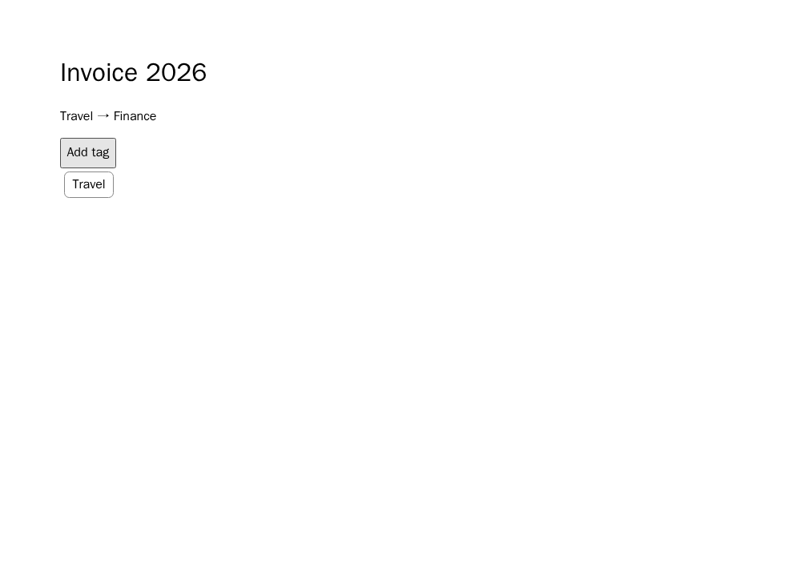

# Paperless-ngx: propagação de tag pai

**Resultado exploratório prospectivo:** 18 novas gerações; 17 saídas
avaliáveis e uma com erro de navegador. B passou 6/6; C falhou apenas na
propagação da tag pai em 6/6. A teve quatro passes, uma falha-alvo e um erro
de navegador. Não há um contraste uniforme entre as duas formulações completas.

A [fonte Paperless-ngx](../../data/e2e-six-projects/sources/paperless-ngx/usage.md)
afirma que adicionar uma tag a um documento também adiciona automaticamente
todas as tags ancestrais. A/B pedem a atribuição de Child e Parent; C retém
Child e omite a propagação. O navegador clica **Add tag**, recarrega e exige
Child e Parent visíveis. Dois documentos usam hierarquias e nomes distintos.
Child, documento, hierarquia, ausência da tag não relacionada e unicidade são
controles. A página comum persiste apenas a lista fornecida pelo código gerado;
ela não propaga automaticamente as tags. O endpoint é uma réplica limitada da
interação, não a aplicação Paperless-ngx original.

O oráculo passou **9/9 controles** no Chromium fixado
`sha256:00d1265095773b7f8a12aa73e81d0bab75563cbd672dd0b5d91783ea1b6d4400`.
Incluiu mutantes da tag pai, de Child, de tag não relacionada, de alteração
apenas visual e casos sem interface. Três revisores LLM independentes deram
ACCEPT ao mapeamento fonte→endpoint, à equivalência A/B, à omissão única em C
e à separação dos controles antes de qualquer geração. Recibos da
qualificação e revisão: `70a2e7da2cba96ff2119b8a8b08d6386883db613fdca8e5bf01fe38e5e02c5d3`
e `b8f1794428e2608cd7d20d3ca2a780780a5f75fa3161a4fe9a7d9be3f2588b79`.
A revisão LLM não substitui adjudicação humana.

O cronograma aleatório A/B/C × Luna/Sol × três repetições, prompts, fonte,
licença, runtime e oráculo foram congelados antes das chamadas. Recibo
`a9523952dfb2f515f52f69c139e250078f7fa5b5d70f66aad9a9255853d3fb6e`.
Os 18 HTMLs foram gerados antes de abrir o navegador, usando a sessão ChatGPT
do Codex, sem chave de API, retry ou reparo.

| Modelo | A completa | B reescrita | C sem propagação |
| --- | ---: | ---: | ---: |
| `gpt-5.6-luna` | 1 passe, 1 falha-alvo, 1 erro de navegador | 3 passes | 3 falhas-alvo |
| `gpt-5.6-sol` | 3 passes | 3 passes | 3 falhas-alvo |

O erro Luna/A veio de chamar `persistTags` com `undefined`, assumindo que a
hierarquia tinha um campo `parent` na raiz. Outra saída Luna/A atribuía Child,
mas não encontrava Parent no mapa e falhou no alvo. O código Luna/A restante
e todos os B satisfizeram o endpoint. Esses resultados são resultados de
geração, não motivo para mudar o scaffold ou reclassificar o lote.

O contraste de falha-alvo **C−B é +6/6** neste requisito. Para C−A, há uma
falha-alvo em A e um A não avaliável; descrever o efeito como +100 pontos
percentuais contra A seria incorreto. As repetições compartilham requisito e
scaffold, logo não são seis requisitos independentes. O
[pacote público](../../data/e2e-paperless-nested-tags/results-20260927/summary.json)
contém os 18 relatórios e prints, recibo
`5c395c8ac4b71f2af1cac699e7ef8d12d0aa0290850885f43db1913cdaf5c229`.
O pacote privado integral tem recibo
`2ef4599761059d83d22b7463006857d487fb5cb1d447ecc4dce9989fa0652c83`.

Este é o **sexto requisito novo executado** do conjunto planejado, no mesmo
projeto já representado. Restam cinco. A intervenção corresponde à família
ampla de incompletude semântica/conteúdo parcial: uma regra de propagação
automática foi retirada. Esse subtipo é nossa interpretação operacional, não
uma classificação validada de smell natural. H1 ordinal e H2 continuam abertos.
