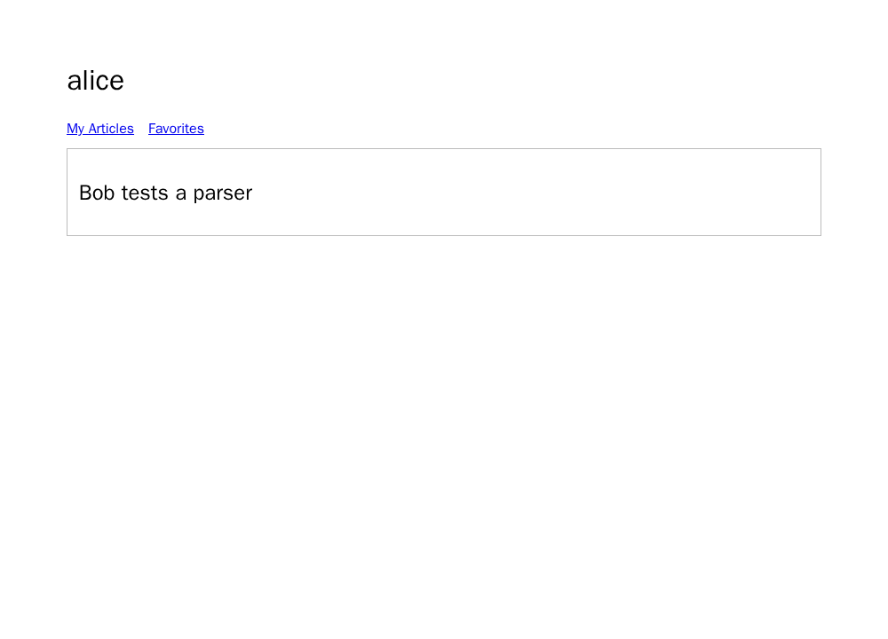

# RealWorld: lista de favoritos no perfil

**Resultado prospectivo:** 18 gerações novas e 18/18 E2Es avaliáveis. A, B e C
passaram 6/6 cada. Não se observou defeito da obrigação omitida neste caso.
Isso não prova equivalência nem ausência de efeito em outros requisitos.

## Fonte, obrigação e endpoint

A [especificação de rotas](../../data/criteria-expansion/sources/realworld/docs__src__content__docs__specifications__frontend__routing.md)
lista `/profile/:username` e `/profile/:username/favorites` e distingue artigos
criados e favoritados. A [especificação de backend](../../data/criteria-expansion/sources/realworld/docs__src__content__docs__specifications__backend__endpoints.md)
define filtros separados `author` e `favorited`. A obrigação pontuada é povoar a
rota Favorites com artigos favoritados pela pessoa do perfil. A/B a incluem;
C conserva ambas as rotas, o cabeçalho e a lista de autoria no perfil comum,
mas omite só a regra de povoar Favorites.

O navegador abre `/profile/alice`, exige que um artigo de autoria apareça,
clica em **Favorites** e recarrega. Na segunda rota, pontua a presença de um
artigo favoritado de outro autor e a ausência do artigo apenas de autoria.
Duas fixtures com IDs e títulos distintos protegem o teste contra um valor
fixo. Cabeçalho, links e IDs únicos são controles não alvo. O endpoint é uma
réplica limitada com dados congelados, não a aplicação RealWorld original.

## Lote inicial: falha de contrato preservada

O primeiro scaffold não declarava o formato de `author` e dos dados de
favoritos. O lote completou 18 gerações, mas A e B falharam em todas as
repetições: algumas saídas não exibiram a lista de autoria inicial; outras
assumiram um campo `favoritedBy` que a fixture não fornecia. As categorias
originais foram 11 falhas-alvo, cinco erros de interface e dois passes C; não
houve nenhum passe A/B.
Os [18 relatórios originais](../../data/e2e-realworld-favorites/instrument-failure-20260926/summary.json)
estão preservados com recibo público
`36691dadb001cda6681d0a9a0d300d9a98bd3b463ee462569930635725314df2`
e recibo privado
`88bc169d35cc5f8c282f64c32c2c055277870793a2f86a0dfcc055146c28d9f3`.
Esse lote **não oferece contraste causal**; o resultado não foi reclassificado
após a correção.

## Sucessor congelado antes da geração

O scaffold sucessor declara um contrato comum de registro
`{id, title, author: {username}, favoritedBy: [username]}` sem implementar a
seleção de artigos. Ele passou **8/8 controles** no Chromium fixado
`sha256:00d1265095773b7f8a12aa73e81d0bab75563cbd672dd0b5d91783ea1b6d4400`:
duas implementações corretas, dois mutantes alvo, um mutante não alvo, rota
inicial errada, handler ausente e erro de script. Recibo da qualificação:
`4e39363d8ee3a37e58922674c30172aab795906c03f95a86b82ec5bcd41da9f9`.
Três revisores LLM isolados aceitaram a equivalência A/B, a omissão em C,
o mapeamento das duas fontes ao endpoint e o risco de vazamento baixo antes do
freeze. Recibo: `5ae06257fe6ccd63893c07cd71e62fd7c805100b1730890f07e8f80f77167997`.
Essa revisão não substitui adjudicação humana.

O cronograma aleatório de 18 posições A/B/C × dois modelos × três repetições,
os prompts, o runtime e o oráculo foram congelados com recibo
`67be1472d2f03e6ed244f782b7698e52be23f2f7a91fb0e09802a53be6dd7375`.
As 18 gerações por sessão ChatGPT terminaram antes de abrir qualquer HTML no
navegador, sem chave de API, retry, reparo ou reutilização do primeiro lote.
Todas as páginas respeitaram o scaffold e foram avaliáveis.

| Modelo | A completa | B reescrita | C sem regra de favoritos |
| --- | ---: | ---: | ---: |
| `gpt-5.6-luna` | 3/3 passes | 3/3 passes | 3/3 passes |
| `gpt-5.6-sol` | 3/3 passes | 3/3 passes | 3/3 passes |

O contraste descritivo de falha-alvo C−A é **0/6**. Em C, os modelos
recuperaram a regra ausente usando a rota Favorites e o campo `favoritedBy` do
scaffold. Isso mostra uma via de recuperação contextual; o próprio scaffold
pode facilitar essa recuperação e limita a generalização. O resultado é de
uma obrigação selecionada, com repetições aninhadas e dois modelos da mesma
família. Não estima efeito médio geral, não confirma H1 ordinal nem testa H2.

O [resumo público, 18 relatórios e prints](../../data/e2e-realworld-favorites/results-20260926/summary.json)
tem recibo
`804640657cb694043da8dc09f486811be0e572edcbc05b58916f1dcc94e7e2b7`;
o pacote privado selado tem recibo
`6becfa883184d0d4c7f2026cf48b1358c0de5bae4cfae3f7c2b88bfa7a0a6a2b`.
As imagens A e C abaixo mostram o mesmo estado observável, mas as repetições
entre braços não formam pares naturais.

É a **quarta obrigação nova executada** do bloco planejado, em um projeto já
representado. Restam sete obrigações novas e a ponte TodoMVC.
