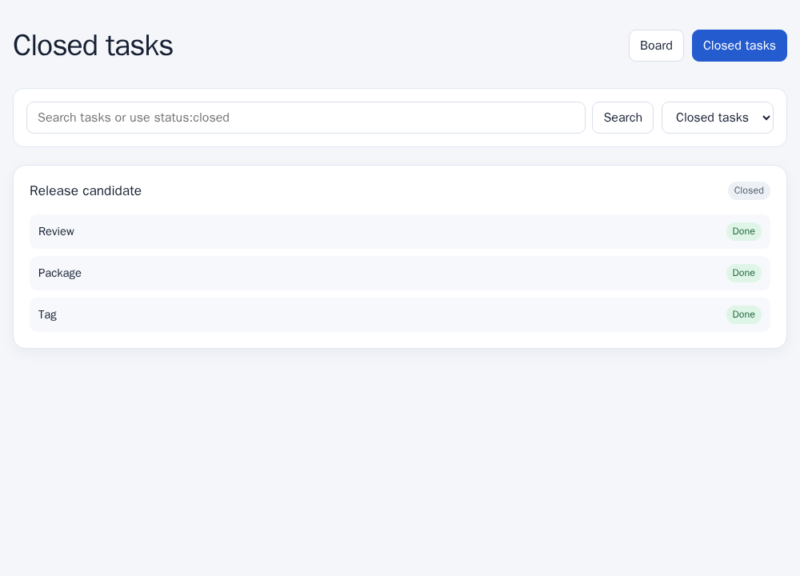
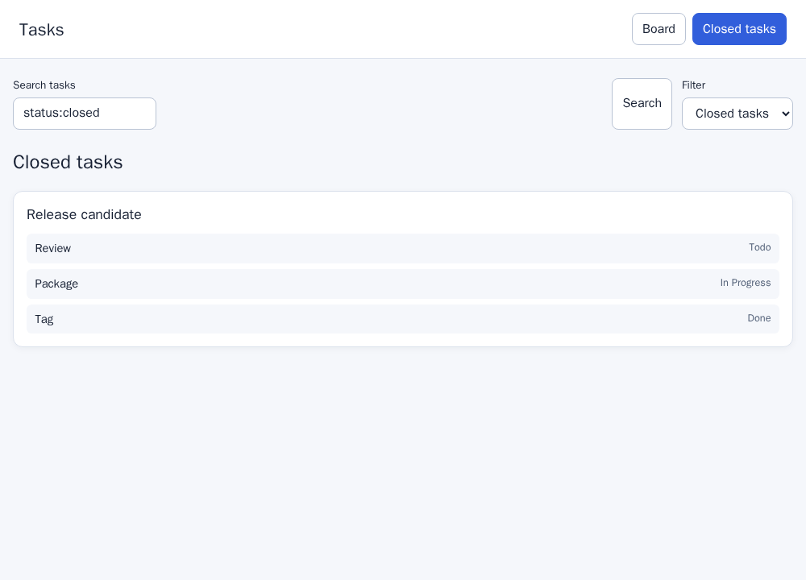

# Four-project E2E expansion: collected result

The prospectively frozen expansion completed all 72 planned Codex generations
on September 25, 2026: four projects, three requirement arms, two model
configurations, and three repetitions. Generation used saved ChatGPT
authentication, low reasoning effort, concurrency one, and no API-key fallback,
retry, resume, output repair, or replacement. All generation finished before any
generated HTML was opened in a browser.

The collection used 1,449,996 input tokens, including 894,592 reported cached
input tokens, 144,869 output tokens, and 13,459 separately reported reasoning
output tokens. The provider exposed no immutable model snapshot or monetary
cost. The private 1,164-file receipt has SHA-256
`6039b4bb2fba7d32e0ab6a4ee41e2ab002d96df3e8b26985a70fe1405805212a`.

## Result

Only 8 of 72 browser executions were evaluable: six passed and two failed only
the target obligation. The other 64 remained unknown: 38 interface errors and
26 browser errors caused by absent or unusable required controls. They are not
counted as either passes or defects.

| Project | Evaluable | Pass | Target failure | Unknown |
|---|---:|---:|---:|---:|
| Kanboard | 6/18 | 4 | 2 | 12 |
| Paperless-ngx | 1/18 | 1 | 0 | 17 |
| OpenProject | 1/18 | 1 | 0 | 17 |
| Nextcloud | 0/18 | 0 | 0 | 18 |
| **Total** | **8/72** | **6** | **2** | **64** |

Kanboard with `gpt-5.6-luna` is the sole informative new contrast. All three A
artifacts passed. In C, two artifacts failed only the obligation that closing a
task changes unfinished subtasks to `Done`; the third was not evaluable. Thus
the fixed-denominator C−A target-failure difference is bounded from **+66.7 to
+100 percentage points**. The lower bound remains positive even if the unknown C
artifact is treated as a pass. B produced one pass and two unknowns, so B−A is
bounded from 0 to +66.7 points and does not isolate a wording effect.

For replication 1, the A and C artifacts both closed the target task, moved it
to Closed tasks, left the unrelated task unchanged, and emitted no console
error. A visibly changed `Review` and `Package` to `Done`; C left them as `Todo`
and `In Progress`. The original frozen reports assigned those labels. The two
additional Closed tasks screenshots were captured afterward from the unchanged
saved HTML solely to make the already-recorded state visible; they did not
participate in classification.

## What the pilot establishes

This is prospective browser evidence of an omission effect in one additional
project and model cell. Together with the earlier TodoMVC and RealWorld pilots,
the study now has informative E2E evidence in three projects. The six-project
corpus was planned and generated, but Paperless-ngx, Nextcloud, and OpenProject
did not yield enough interface-conformant artifacts for a treatment contrast.
They cannot be presented as supporting or refuting H1.

The result therefore strengthens the claim that omitting a requirement
obligation *can* cause a visible behavioral defect and that the effect can recur
outside TodoMVC. It does not show a general average effect, confirm H1, or
evaluate H2. Model behavior also remains heterogeneous: the Kanboard contrast
was evaluable for Luna, while every Sol Kanboard artifact was unknown.

## Failure analysis and successor design

The principal failure was scaffold conformance rather than provider
availability. All 72 provider calls completed, but generated pages frequently
ignored exact DOM requirements: only 2/18 Paperless artifacts contained the
required `data-document-id`, 0/18 Nextcloud artifacts contained
`data-file-id`, and exact OpenProject field labels appeared in at most 2/18
artifacts. Kanboard was more compatible but still produced only six evaluable
pages.

The next collection should freeze a common executable scaffold per project and
vary only the behavior implementation supplied to that scaffold. The A/B/C
requirements, generation order, independent behavioral assertions, and
missingness accounting should remain unchanged. This removes DOM invention as
a dominant source of unknown outcomes and makes the next study answer the
causal requirement question rather than conformance to an English interface
contract. Because this redesign follows observed failures, it must be declared
a successor pilot and must not replace or silently repair this denominator.

Public aggregate rows, all 72 browser reports, the eight original evaluable
screenshots, two post-hoc explanatory screenshots, and hashes are in
`data/e2e-six-projects/results-20260925`. Raw generations and provider captures
remain private. The public bundle receipt SHA-256 is
`b6f7067dae5faf67fd33372f2de868fb89054532ee9198e04ec0fce16b208017`.
