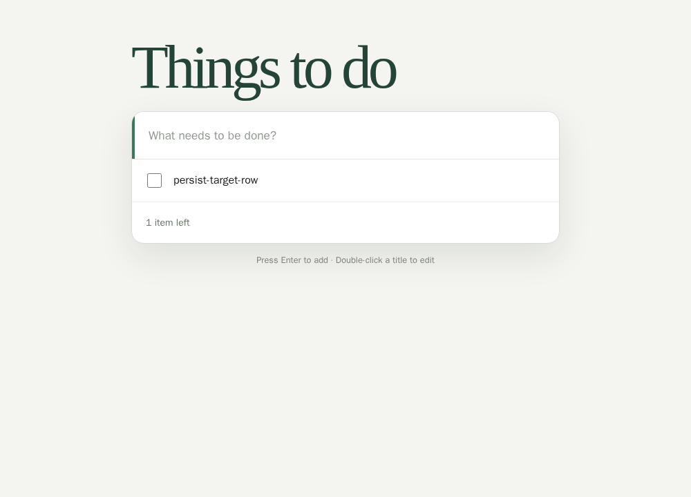
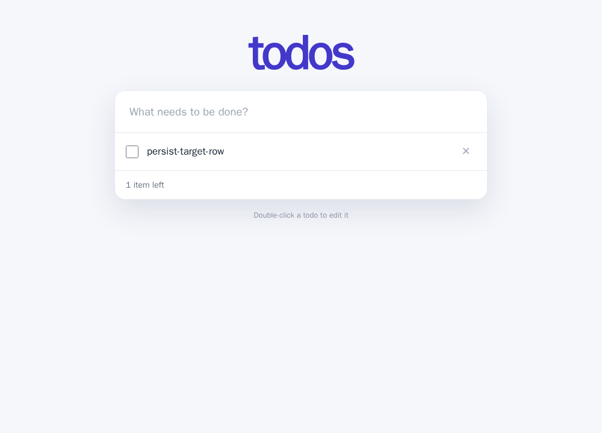

# TodoMVC: ponte de persistência do modo de edição

**Resultado prospectivo:** 18 novas gerações, 17 resultados E2E avaliáveis e
nenhuma falha da obrigação-alvo. A e B passaram 6/6 cada; C passou 5/6, com
um erro de interface não avaliável. Não se observou degradação entre as cinco
saídas C avaliáveis. O caso ausente impede tratar o contraste como 0/6.

## Contrato e desenho

A [especificação TodoMVC](../../data/criteria-expansion/sources/todomvc/app-spec.md)
exige que o modo de edição não seja persistido. O navegador cria um item,
entra em edição e abre uma nova página na mesma origem. O item deve continuar
visível fora do modo de edição nessa nova página. A e B contêm a obrigação;
C omite somente a frase correspondente. Este é o mesmo requisito do piloto
anterior, portanto **uma replicação de ponte**, sem nova diversidade de
requisitos ou projetos.

O seletor semântico e o runtime passaram 27/27 controles autorais antes da
coleta, na imagem `sha256:7ec0ab7cde9cf5b84b0ee5d4c07e86a94f1a696c8a26c6ccdbd73569ae460d4a`.
Seu pacote privado contém 193 arquivos verificados. Uma primeira rodada de
revisão LLM falhou porque a *pergunta de revisão* descrevia o endpoint ao
contrário; ficou preservada. Com a descrição corrigida, três revisores
isolados aceitaram a manipulação e o oráculo antes do congelamento; recibo
`b811e6265ee6101f89ef317ef36b8fb330fe8fecb2b9a80b2ae10b4566c6fec0`.
Isso não substitui revisão humana.

Prompts existentes de 23 de setembro, fonte, licença, schedule aleatório,
runtime, executável e imagem foram vinculados no freeze
`ed439908e3755aa0ca6404bb0bfa7e7bf6f12c0e45499814e08772eaa04fbe0f`.
O desenho tem A/B/C × Luna/Sol × três repetições. As 18 gerações em contextos
separados terminaram antes da avaliação no navegador. O cliente usou a sessão
ChatGPT, sem chave de API, retry, reparo ou descarte seletivo.

| Modelo | A completa | B reescrita | C sem obrigação |
| --- | ---: | ---: | ---: |
| `gpt-5.6-luna` | 3/3 passes | 3/3 passes | 2/3 passes; 1 erro de interface |
| `gpt-5.6-sol` | 3/3 passes | 3/3 passes | 3/3 passes |

No único erro, a página não apresentou exatamente um título visível para
iniciar a edição. O navegador não chegou ao endpoint-alvo, portanto não é
falha de persistência nem acerto; o HTML, relatório e categoria originais
permanecem no pacote privado. Os outros 17 casos passaram, inclusive as cinco
saídas C avaliáveis. O resultado é compatível com recuperação da regra ou
implementação segura por hábito do modelo; não demonstra equivalência.

Os [18 relatórios públicos, resumo e prints](../../data/e2e-todomvc-persistence-bridge/results-20260926/summary.json)
têm recibo `f36f60da0635256ccd6f1205b94f76059846c0ba92eff12ad061b469d827983f`.
O pacote privado de prompts, gerações, HTMLs e execuções tem recibo
`60fcbb2935633647038553c459566082062dadba44d1009d0cab007330c9dfef`.
Os prints mostram o estado antes e depois do reload; repetições entre braços
não são pares naturais.

O piloto anterior tinha 13 acertos e cinco casos desconhecidos; este é um
lote novo, não uma reclassificação daqueles artefatos. A ponte foi executada,
mas os **sete requisitos novos** pendentes continuam pendentes. O endpoint
é binário de comportamento, não a severidade ordinal formal de H1. Não mede
os sinais antecipados de H2.
